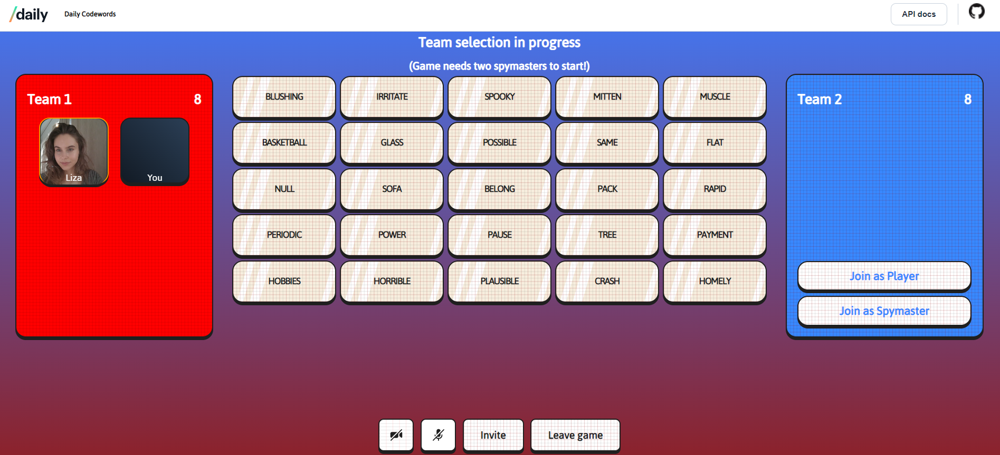

# Daily Codewords

This demo shows one way to implement a social gaming application with video integration using [Daily's call object](https://docs.daily.co/guides/products/call-object).

## Getting set up with Daily

To use this demo, you will need a Daily API key.

To get a Daily API key, [create a free Daily account](https://dashboard.daily.co/signup)

Once you have an account and are logged into the [Daily Dashboard](https://dashboard.daily.co/), copy your API key [here](https://dashboard.daily.co/developers). Your domain

Copy `.env.sample` in this repository's root to a file called `.env` and fill in the `DAILY_DOMAIN` and `DAILY_API_KEY` variables. Do not commit this file!

## How the demo works

This demo allows users to create and join Codewords games with their friends. Video call participants join one of two teams as either a player or spymaster. The spymaster provides one-word clues tying one or more team words together. Players on that team then try to guess the correct words based on the spymaster's hint.

## Running locally

1. Install dependencies `npm i`
2. Run `npm run build`
3. Run `npm run start`

## Contributing and feedback

Let us know how experimenting with this demo goes! Feel free to reach out to us any time at `help@daily.co`.
